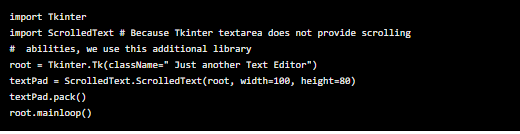
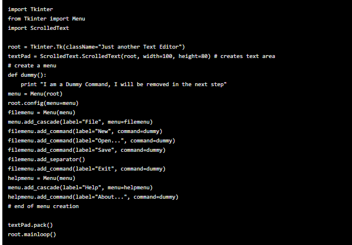
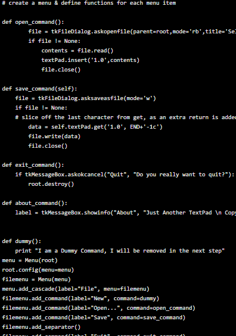
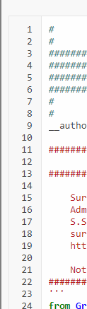
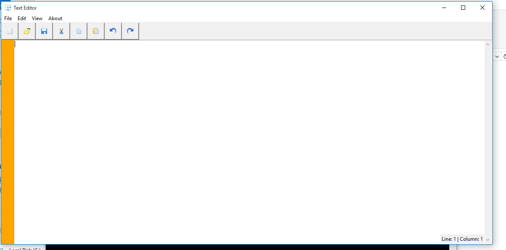

# Text Editor designed in Python & Tkinter
Let’s see how we can design a simple text editor like notepad using Python.

We will stick to the basic functionalities expected of a simple text editor – which includes the ability to – write something on the notepad, save it and open and modify it whenever required. For the purpose of this tutorial we will design the GUI in Tkinter.

Additionally we will use another standard python module called ScrolledText because the text widget module of Tkinter does not support scrolling functionality.

#  The barebone text editor

So here’s the starting code for a text editor:

This code will give you a barebone text editor with a text area where you can write text. Our core functionality achieved !

# Adding Menu Items
In the next step, we will add a menu bar with two main menu items: file & help.
Within file menu we will add 4 sub menu items new, open, save and exit.
Within help , we will have one menu called about

In this section we simply add the menu button and assign each of them to a temporary dummy command function which we call “dummy” here. We will add the indivdual functionalities for each of these menu items in the next step.

# Adding Functionality to each Menu Item

Now that we have the menu items ready, its time to add functionality to each of the menu items. Upto now all menu items callback the dummy function. We will now delete the dummy function and create function callback for each of the menu items.

# Adding line number

# Output of Text Editor.

Its look like:

